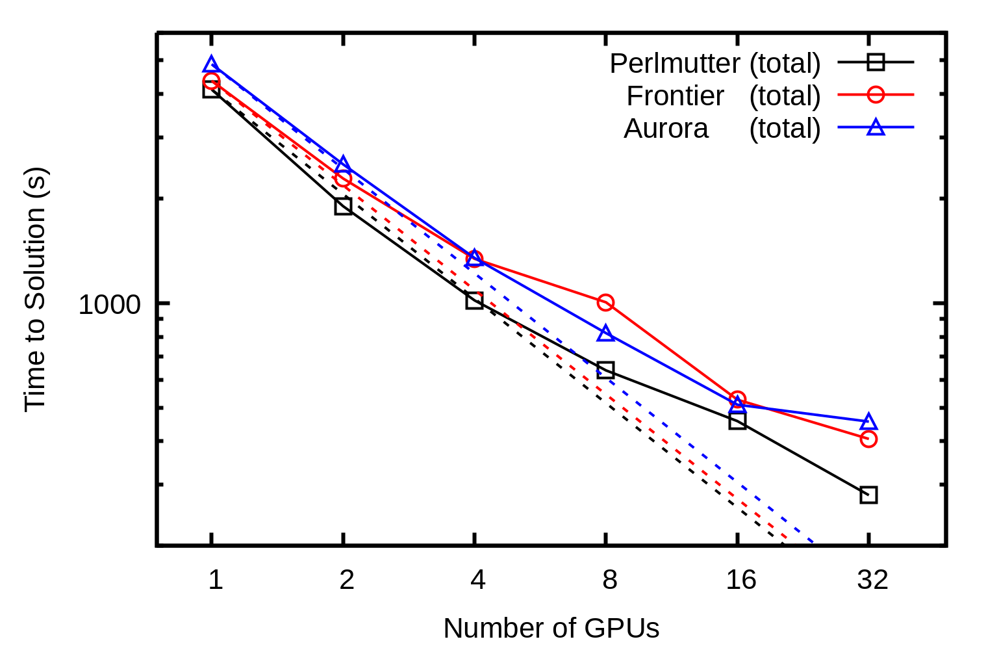
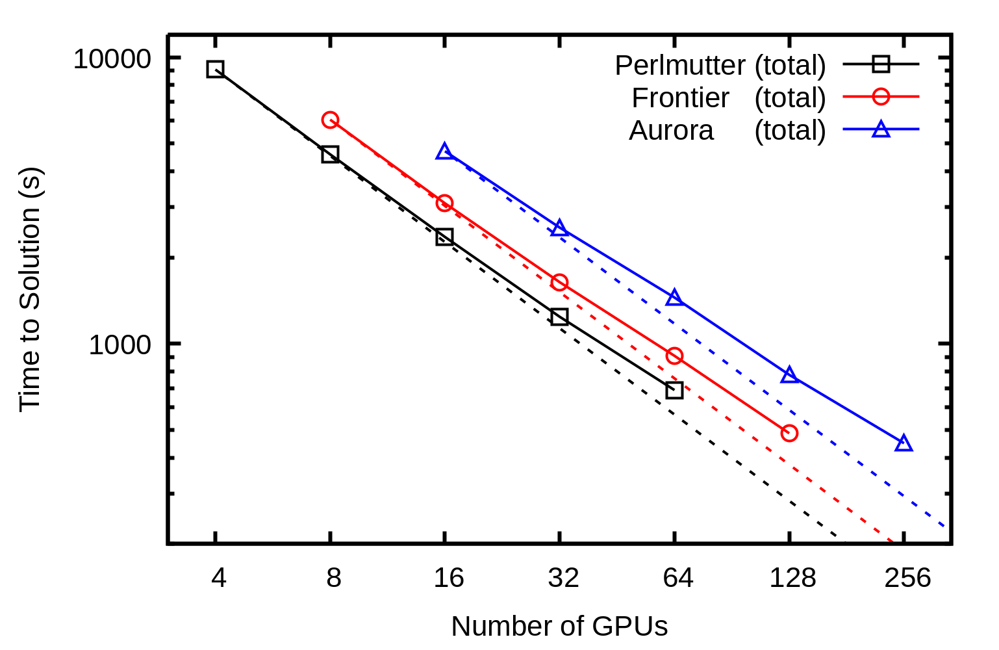
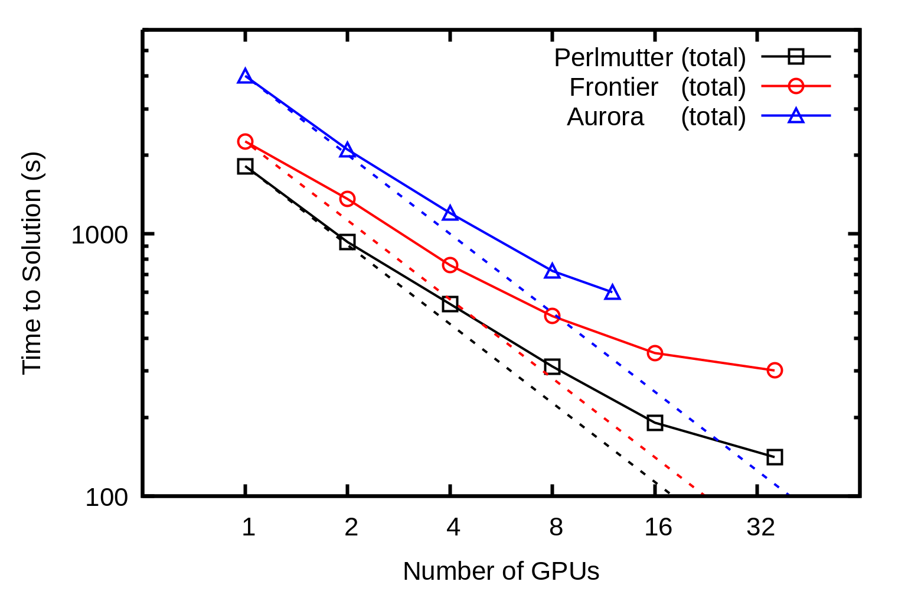
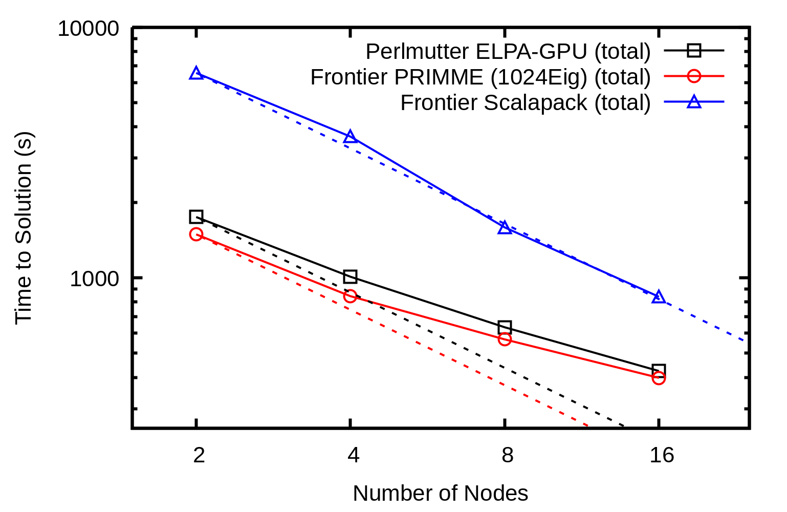

# Performance Tests

## Overview

This folder contains performance tests for BerkeleyGW on different platforms.
It is originally for the Perlmutter proposal due 4/29/2025.

## Scaling Plots

An anthracene unit cell contains 48 atoms, which is a small size for organic crystals.

Anthracene GPU BGW epsilon strong scaling plot:

Anthracene GPU BGW sigma strong scaling plot:

Anthracene GPU BGW kernel strong scaling plot:

Anthracene GPU BGW absorption strong scaling plot:

## Running Time
For the table below, Quantum Espresso (QE) is compiled with CPU version, while BerkeleyGW (BGW) is compiled with GPU version.

| Cluster | Number of Atoms | System | QE Node Hours | BGW Node Hours | Notes |
|---------|-----------------|-----------|---------------|----------------|-------|
| Polaris | 29 | 2D TADF | 8.3 | 297 | 55/856 bands, cutoff 20 Ry |

## For the Proposal
### Scaling Plots
Please refer to the GitHub repo [BGWHelper](https://github.com/Luo-Yiqun/BGWHelper) for the scaling plots.

### Justification of node hours
After initial screening, we identified approximately 17 anthracene derivatives, 3 pentacene derivatives, 2 perylene derivatives, and 8 azobenzene derivatives as promising Triplet-Triplet Annihilation (TTA) candidates.
We propose to further compute their excitonic properties with high accuracy.

For the production phase, we estimate requiring approximately 50 node hours per structure for Quantum ESPRESSO (QE) and 300 node hours per structure for BerkeleyGW (BGW):
- In QE, the cost of diagonalization scales cubically, while the number of bands scales approximately as $\mathcal{O}(N)$, where $N$ is the number of atoms, while the k grid size decreases.
For our case, the overall scaling effectively approches $\mathcal{O}(N)$, which leads to 50 node hours per structure for QE.
- For BGW, the GW calculation scales positively with $N$, while the Bethe-Salpeter Equation (BSE) component benefits from reduced k-point requirements in larger systems.
We benchmarked the scaling based on a representative 2D TADF organic crystal.

Additionally, convergence tests are necessary to refine the computational setup. These tests are expected to cost approximately three times the resources of standard calculations.
At least three structures will undergo convergence testing, resulting in an estimated 450 CPU node hours and 2700 GPU node hours.

In total, we request 1950 CPU node hours and 11700 GPU node hours for the computational effort.
Please refer to the GitHub repo [BGWHelper](https://github.com/Luo-Yiqun/BGWHelper) for more details

### Justification of I/O requirements
Quantum ESPRESSO and BerkeleyGW generate large intermediate files.
For our systems, the data footprint ranges from approximately 600 GB to 2.5 TB, with an average of around 1.6 TB per structure.
Given the scratch/community space to be 20TB each, we can run 12 structures each at a time.

After computations are completed, only essential input and output files need to be archived, with a total size of around 20 MB per structure, which is negligible for long-term storage.